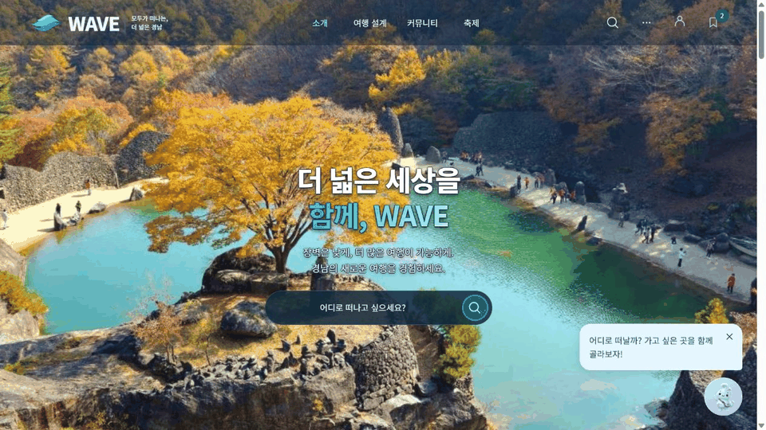
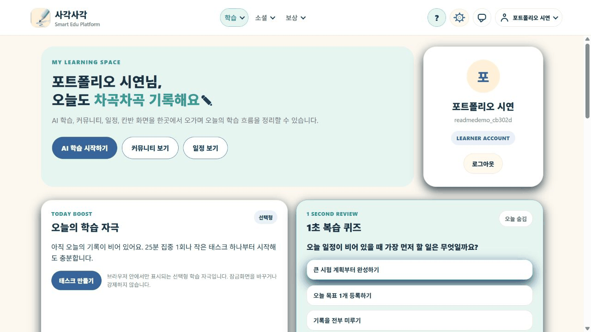
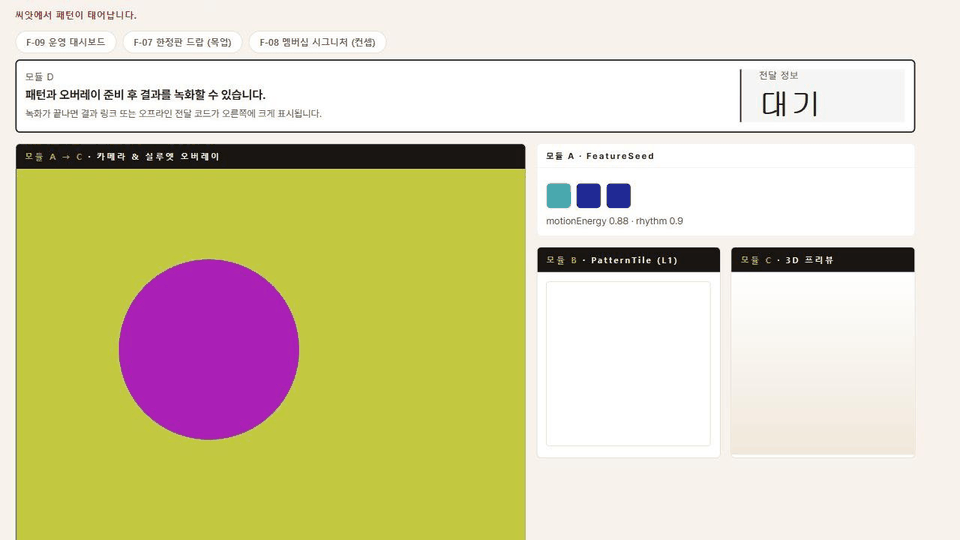
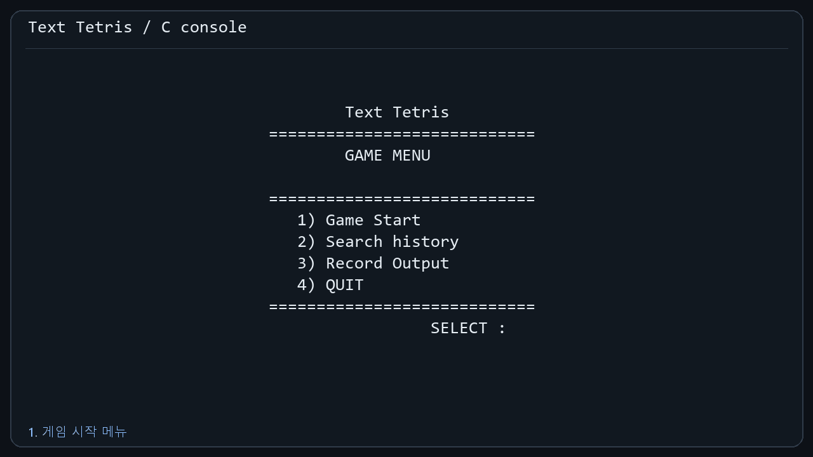
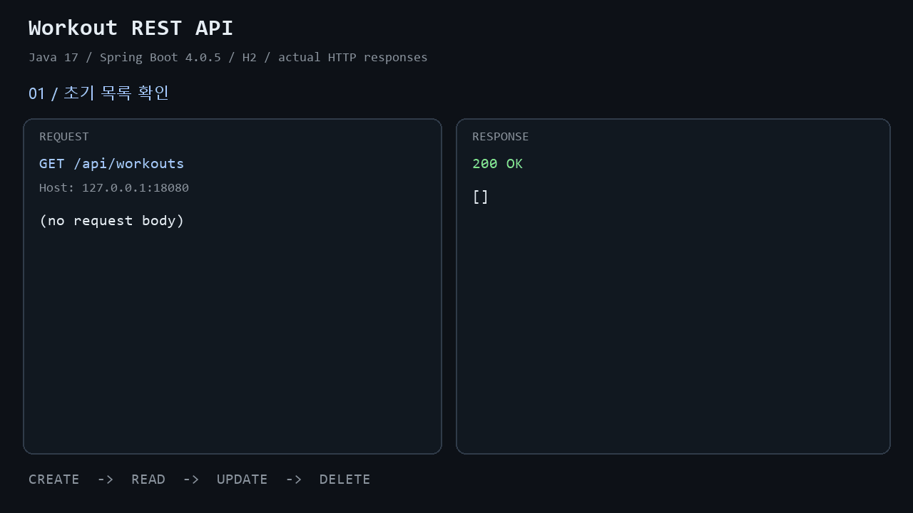
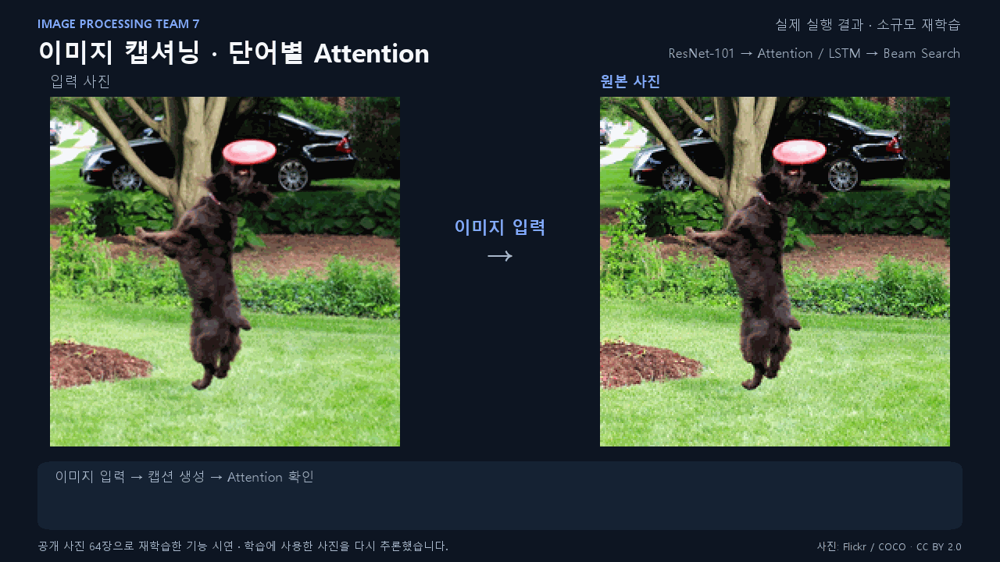
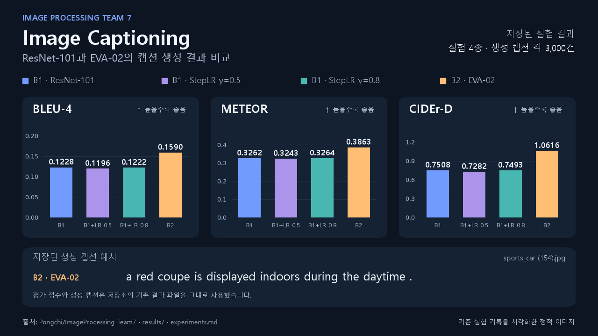

## 프로젝트 포트폴리오

공개 협업 프로젝트를 모았습니다. 역할과 결과는 확인 가능한 PR·커밋을 기준으로 적었습니다. [전체 저장소](https://github.com/unknownamed?tab=repositories) · [작성한 PR](https://github.com/pulls?q=is%3Apr+author%3Aunknownamed)

### 대표 프로젝트

#### [W.A.V.E](https://github.com/jeongiryang/wave-barrier-free-gyeongnam) · 경남 무장애 여행 플래너

실제 배포 화면(16:9): 편의시설 선택 → 여행지·편의 근거 확인 → 일정·지도 → 나루의 일정 수정 도구.

- **목표:** 필요한 편의시설을 기준으로 여행지를 찾고 일정까지 계획하는 웹 서비스.
- **맡은 작업:** AI 여행 도구 28개를 일정·지도·저장 화면에 연결하고, 화면을 오가도 입력과 여행 상태가 유지되도록 개선. 공개 시연용 일정과 여행집도 운영 DB에 연결.
- **결과:** 로그인 없이 살펴볼 수 있는 예시 일정 5건과 사진 코스 예시 3건을 제공.

[서비스 보기](https://wave-barrier-free-gyeongnam.vercel.app/) · [일정 화면](https://github.com/jeongiryang/wave-barrier-free-gyeongnam/blob/main/docs/screenshots/wave-planner-itinerary-mobile.png) · [여행 도구 연결 PR](https://github.com/jeongiryang/wave-barrier-free-gyeongnam/pull/742) · [시연 자료 PR](https://github.com/jeongiryang/wave-barrier-free-gyeongnam/pull/752)

#### [사각사각](https://github.com/jeongiryang/SoftwareEngineering_team15_project_-Smart-Edu-Platform) · 학습 관리 플랫폼의 접근성·일정 개선

시연 계정으로 직접 실행한 PC 화면(16:9): 접근성 설정·고대비 적용 → 학습 일정 등록 확인 → 일정과 연결한 칸반 태스크의 TODO → IN_PROGRESS → DONE 변경.

[기존 접근성 설정 기록 화면](https://github.com/jeongiryang/SoftwareEngineering_team15_project_-Smart-Edu-Platform/blob/main/screenshots/accessibility-settings/20260603-020-accessibility-settings-screen.png)

- **목표:** 학습 계획·기록·복습을 이어 주는 앱을 더 다양한 사용자가 편하게 사용할 수 있도록 개선.
- **맡은 작업:** 글자 크기·고대비·초등학생 친화 설정을 로그인 후 전체 화면에 적용. 본문 텍스트 읽어주기와 전역 `전체 읽기`를 정리하고, 주요 입력 화면으로 음성 입력 적용 범위를 확대. 일정 화면에 복습 알림 생성 패널을 배치.
- **확인:** 접근성·일정 UI 개선 PR이 병합되었고, PR에 프론트엔드 검사와 테스트 결과가 기록되어 있습니다.

[서비스 보기](https://sagaksagak-smart-edu.vercel.app/) · [팀 시연 영상](https://www.youtube.com/watch?v=_CGbutTUGhk&t=380s) · [접근성·일정 개선 PR](https://github.com/jeongiryang/SoftwareEngineering_team15_project_-Smart-Edu-Platform/pull/209)

#### [Living Visetos](https://github.com/woohyun212/living-visetos) · 개인화 패턴 키오스크

저장소의 모의 카메라 데모를 직접 실행한 PC 화면: 특징값·색상 → L1 패턴 타일 → 3D 가방 적용. 실제 관객용 무대는 세로형 키오스크입니다.

- **목표:** 관객의 색·움직임·리듬으로 고유 패턴을 만들고 가방에 적용하는 체험.
- **맡은 작업:** `FeatureSeed`를 받아 1024×1024 패턴 타일을 만드는 F-02 엔진 구현. 움직임에 따른 반복 밀도, 리듬에 따른 모티프 변화, 입력 색상과 세션별 변주를 반영.
- **결과:** 같은 시드로 같은 패턴을 재현하고, 생성한 타일을 실루엣·가방 화면에 전달.

[패턴 엔진 PR](https://github.com/woohyun212/living-visetos/pull/2) · [로컬 데모 실행 방법](https://github.com/woohyun212/living-visetos#실행)

#### [Boothlock Server](https://github.com/hong0527/boothlock-server) · 축제 부스 QR 주문 서버

- **목표:** 짧은 기간 운영하는 축제 부스의 계정과 부스 설정을 관리하는 서버.
- **맡은 작업:** 계정·부스 도메인과 저장 계층을 구현. 부스 설정 API에서 관리자와 직원의 변경 권한을 구분하고 계좌 변경 이력을 같은 트랜잭션에 기록.
- **결과:** 관리자 변경은 허용하고 직원의 계좌 변경은 거부하는 권한 검증, 빈 요청 검증, 동일 값 재요청 처리를 확인.

[계정·부스 도메인 PR](https://github.com/hong0527/boothlock-server/pull/1) · [부스 설정 API PR](https://github.com/hong0527/boothlock-server/pull/6)

### 개인 프로젝트 · 실행 GIF

#### [C 테트리스](https://github.com/unknownamed/Tetris-implemented-in-C) · 콘솔 게임

**C · Windows 콘솔** — 게임 시작 → 이동·회전·즉시 낙하 → 종료 → 기록 조회. 원본 C 소스를 컴파일하고 실제 콘솔 출력과 키 입력을 16:9 GIF로 정리했습니다.

[프로젝트·빌드 방법](https://github.com/unknownamed/Tetris-implemented-in-C) · [실행 환경](https://github.com/unknownamed/Tetris-implemented-in-C/blob/master/docs/demo-capture.md)

#### [Workout REST API](https://github.com/unknownamed/Implementing-a-simple-REST-API-with-Spring-Boot) · 운동 기록 API

**Java 17 · Spring Boot · H2** — 기록 생성(201) → 조회 → 수정 → 삭제(204). JAR를 빌드·실행한 뒤 받은 실제 HTTP 요청·응답을 16:9 화면으로 구성했습니다.

[프로젝트·API 명세](https://github.com/unknownamed/Implementing-a-simple-REST-API-with-Spring-Boot) · [빌드·실행 환경](https://github.com/unknownamed/Implementing-a-simple-REST-API-with-Spring-Boot/blob/main/docs/demo-capture.md)

### 다른 협업 프로젝트

#### [Image Processing Team 7](https://github.com/Pongchi/ImageProcessing_Team7) · 이미지 캡셔닝과 Attention 시각화

**실제 코드 실행 GIF(16:9)** — 이미지 입력 → Beam Search 캡션 생성 → 단어별 Attention 확인. 공개 사진 64장으로 소규모 재학습하고, 학습에 사용한 사진에서 동작을 확인한 시연입니다.

[시연 조건·실행 기록](docs/image-processing-demo.md) · [정지 이미지](assets/image-processing-attention-demo.png)

기존 실험 결과 비교

**저장된 실험 결과(16:9)** — 모델·학습률 설정 4종의 BLEU-4·METEOR·CIDEr-D와 생성 캡션을 정리했습니다. 기존 결과 파일을 시각화한 정적 이미지입니다.

- **맡은 작업:** Beam Search 추론, 평가 지표 계산, 단어별 Attention 히트맵과 샘플 통합 시각화 구현.

[실험 기록](https://github.com/Pongchi/ImageProcessing_Team7/blob/master/experiments.md) · [생성 캡션](https://github.com/Pongchi/ImageProcessing_Team7/blob/master/results/generated_baseline2.csv) · [기여 커밋](https://github.com/Pongchi/ImageProcessing_Team7/commit/de733d7d759147a2af515a2968b30650c12cb87d)

- **[Nuguri](https://github.com/Gongdang0314/nuguri)** — C 콘솔 게임의 점프·충돌 오류와 Windows 화면 출력 성능 개선. [커밋](https://github.com/Gongdang0314/nuguri/commit/2d8d2cf05207a56ca1b51a0392ff4f824027607f)
- **[Diablo](https://github.com/Gongdang0314/diablo)** — C 텍스트 게임의 퀘스트·입력 처리와 실행 오류 수정. [커밋 기록](https://github.com/Gongdang0314/diablo/commits/main/?author=unknownamed)
- **[Makepic](https://github.com/Gongdang0314/makepic)** — 텍스트 기반 그림판 팀 과제.
