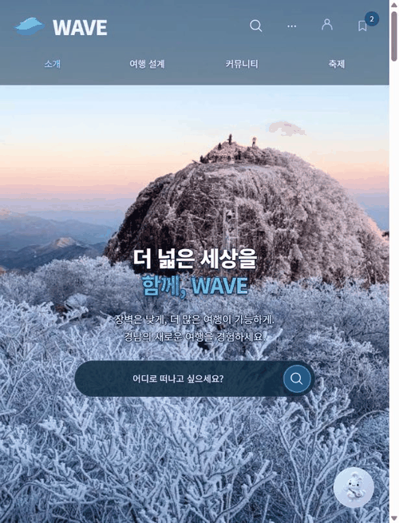

## 프로젝트 포트폴리오

공개 협업 프로젝트를 모았습니다. 역할과 결과는 확인 가능한 PR·커밋을 기준으로 적었습니다. [전체 저장소](https://github.com/unknownamed?tab=repositories) · [작성한 PR](https://github.com/pulls?q=is%3Apr+author%3Aunknownamed)

### 대표 프로젝트

#### [W.A.V.E](https://github.com/jeongiryang/wave-barrier-free-gyeongnam) · 경남 무장애 여행 플래너

실제 배포 화면: 지역·편의 선택 → 편의 근거 확인 → 일정·지도 → 나루로 일정 수정.

- **목표:** 필요한 편의시설을 기준으로 여행지를 찾고 일정까지 계획하는 웹 서비스.
- **맡은 작업:** AI 여행 도구 28개를 일정·지도·저장 화면에 연결하고, 화면을 오가도 입력과 여행 상태가 유지되도록 개선. 공개 시연용 일정과 여행집도 운영 DB에 연결.
- **결과:** 로그인 없이 살펴볼 수 있는 예시 일정 5건과 사진 코스 예시 3건을 제공.

[서비스 보기](https://wave-barrier-free-gyeongnam.vercel.app/) · [일정 화면](https://github.com/jeongiryang/wave-barrier-free-gyeongnam/blob/main/docs/screenshots/wave-planner-itinerary-mobile.png) · [여행 도구 연결 PR](https://github.com/jeongiryang/wave-barrier-free-gyeongnam/pull/742) · [시연 자료 PR](https://github.com/jeongiryang/wave-barrier-free-gyeongnam/pull/752)

#### [KG Decision Framework](https://github.com/jeongiryang/kg-ontology-decision-framework) · 근거를 확인할 수 있는 AI 의사결정 지원

- **목표:** 질문에 대한 답변과 그 근거가 된 데이터·문서를 함께 확인할 수 있는 화면.
- **맡은 작업:** 실시간 대화 UI를 기존 질의 서비스에 연결하고 Citation과 PDF 근거 강조를 구현. 실제 조회 경로, 실행 정보, 결과 그래프를 서로 다른 시각화로 구분.
- **결과:** 사용자가 답변 근거와 그래프 탐색 과정을 단계별로 확인할 수 있도록 구성.

[대화·근거 화면 PR](https://github.com/jeongiryang/kg-ontology-decision-framework/pull/14) · [그래프 UX PR](https://github.com/jeongiryang/kg-ontology-decision-framework/pull/38)

#### [사각사각](https://github.com/jeongiryang/SoftwareEngineering_team15_project_-Smart-Edu-Platform) · 학습 관리 플랫폼의 접근성·일정 개선

팀 프로젝트에 기록된 접근성 설정 화면. 글자 크기, 돋보기, 고대비, 읽어주기, 음성 입력을 한곳에서 확인할 수 있습니다.

- **목표:** 학습 계획·기록·복습을 이어 주는 앱을 더 다양한 사용자가 편하게 사용할 수 있도록 개선.
- **맡은 작업:** 글자 크기·고대비·초등학생 친화 설정을 로그인 후 전체 화면에 적용. 본문 텍스트 읽어주기와 전역 `전체 읽기`를 정리하고, 주요 입력 화면으로 음성 입력 적용 범위를 확대. 일정 화면에 복습 알림 생성 패널을 배치.
- **확인:** 접근성·일정 UI 개선 PR이 병합되었고, PR에 프론트엔드 검사와 테스트 결과가 기록되어 있습니다.

[서비스 보기](https://sagaksagak-smart-edu.vercel.app/) · [접근성·일정 개선 PR](https://github.com/jeongiryang/SoftwareEngineering_team15_project_-Smart-Edu-Platform/pull/209)

#### [Boothlock Server](https://github.com/hong0527/boothlock-server) · 축제 부스 QR 주문 서버

- **목표:** 짧은 기간 운영하는 축제 부스의 계정과 부스 설정을 관리하는 서버.
- **맡은 작업:** 계정·부스 도메인과 저장 계층을 구현. 부스 설정 API에서 관리자와 직원의 변경 권한을 구분하고 계좌 변경 이력을 같은 트랜잭션에 기록.
- **결과:** 관리자 변경은 허용하고 직원의 계좌 변경은 거부하는 권한 검증, 빈 요청 검증, 동일 값 재요청 처리를 확인.

[계정·부스 도메인 PR](https://github.com/hong0527/boothlock-server/pull/1) · [부스 설정 API PR](https://github.com/hong0527/boothlock-server/pull/6)

### 다른 협업 프로젝트

- **[Living Visetos](https://github.com/woohyun212/living-visetos)** — 사용자 움직임·리듬·색상을 반영하는 개인화 패턴 생성 엔진 구현. [PR](https://github.com/woohyun212/living-visetos/pull/2)
- **[Data Communication](https://github.com/He6venly/Data_Communication)** — 줄 단위 JSON 소켓 프로토콜, 노드별 로그, Worker 간 P2P 작업 전송 구현. [통신 PR](https://github.com/He6venly/Data_Communication/pull/1) · [P2P PR](https://github.com/He6venly/Data_Communication/pull/7)
- **[Image Processing Team 7](https://github.com/Pongchi/ImageProcessing_Team7)** — 이미지 캡셔닝 모델 학습·평가 코드와 Attention 시각화 작업. [커밋](https://github.com/Pongchi/ImageProcessing_Team7/commit/de733d7d759147a2af515a2968b30650c12cb87d)
- **[Nuguri](https://github.com/Gongdang0314/nuguri)** — C 콘솔 게임의 점프·충돌 오류와 Windows 화면 출력 성능 개선. [커밋](https://github.com/Gongdang0314/nuguri/commit/2d8d2cf05207a56ca1b51a0392ff4f824027607f)
- **[Diablo](https://github.com/Gongdang0314/diablo)** — C 텍스트 게임의 퀘스트·입력 처리와 실행 오류 수정. [커밋 기록](https://github.com/Gongdang0314/diablo/commits/main/?author=unknownamed)
- **[Makepic](https://github.com/Gongdang0314/makepic)** — 텍스트 기반 그림판 팀 과제.
- **[2025 OSSW](https://github.com/Dicaf25/2025OSSW)** — 오픈소스 소프트웨어 수업의 Fork·PR 협업 실습. [PR](https://github.com/Dicaf25/2025OSSW/pull/4)
